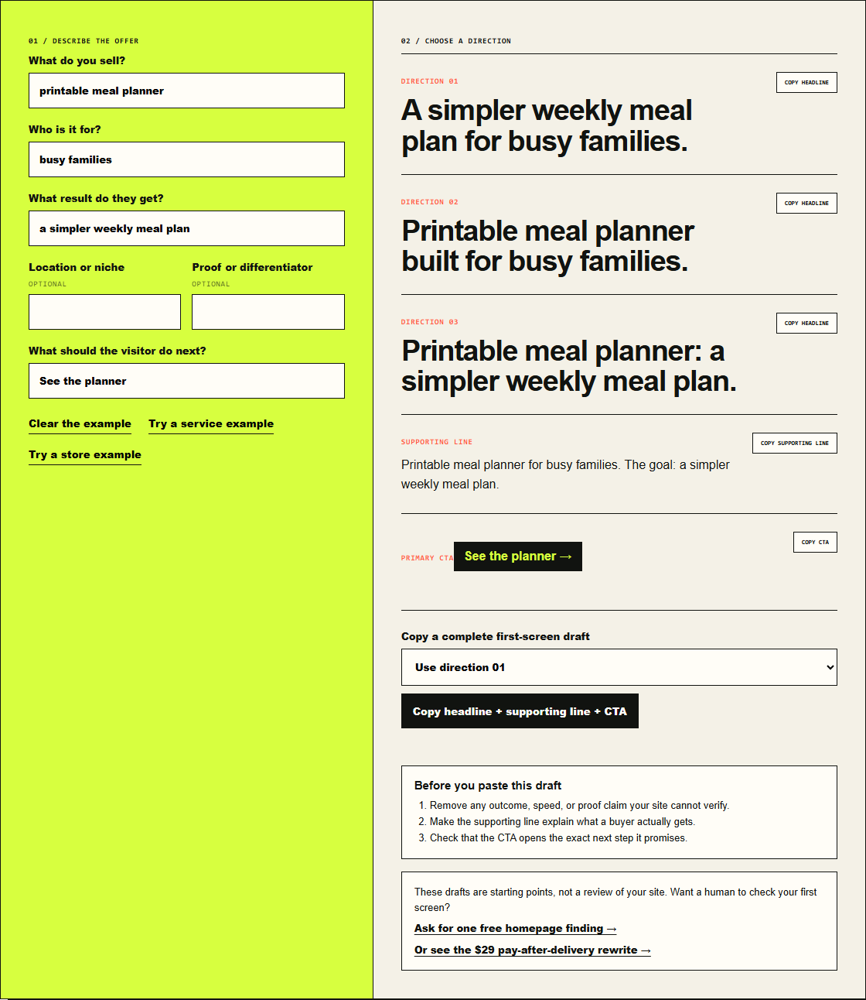

# FirstClick Homepage Headline Generator

A small, local-only browser tool that turns six plain-language inputs into:

- three homepage headline directions;
- a supporting line; and
- a primary call to action.

The tool has no dependencies, login, analytics, ads, uploads, network requests, or build step. It runs entirely in the browser.
Choose one headline direction and use **Copy headline + supporting line + CTA**
to paste a complete first-screen draft in one step. The clipboard action runs
only when you click it.

## Use it

- Live standalone tool: https://elyasibkr.github.io/firstclick-headline-generator/
- FirstClick Fix version: https://firstclick-fix.ppjdmpk.chatgpt.site/open-source/homepage-headline-generator.html

The screenshot uses a fictional store example; it is not a client result or a performance claim.

To run it locally, download the repository and open `index.html` in a modern browser.

## Example: a local pickup service

Enter `wash and fold pickup` as the service, `busy households` as the audience,
`clean laundry returned by tomorrow` as the outcome, and `North Vancouver` as
the location. Add `same-day pickup when booked by 10am` as proof and
`Book a pickup` as the action. The tool produces these three headline options:

1. Clean laundry returned by tomorrow for busy households.
2. Wash and fold pickup built for busy households in North Vancouver.
3. Wash and fold pickup: clean laundry returned by tomorrow.

It also drafts a supporting line and a **Book a pickup** button. If you leave
the optional proof field blank, it uses your stated outcome instead of
inventing a differentiator. Choose the headline that makes the offer clearest
to a new visitor. Check every promise against what the business can actually
deliver, then make sure the button
leads straight to the booking step. The generated copy is a starting point;
specific customer language and proof usually need a human edit.

For three fictional service-business first screens with headlines, supporting
lines, CTAs, and claim-checking notes, see the
[service-business homepage examples](https://elyasibkr.github.io/firstclick-headline-generator/service-business-homepage-examples.html).

## Using it for a Shopify store

The live tool's **Try a store example** button shows how a fictional product
becomes three headline directions, a supporting line, and a CTA. Clear that
example before entering your own product details.

Start with one product collection and one buyer need, not the entire catalog. For
example, a digital invitation shop might enter `editable wedding invitation
templates` as the product, `couples planning their own wedding` as the audience,
`a ready-to-send invitation they can personalize` as the outcome, and `Browse
wedding templates` as the action. Leave the proof field blank unless a claim
such as a review count or delivery speed can be verified on the store.

After generating copy, check the first screen against the actual purchase path:
Does the CTA open the promised collection? Can a new visitor tell whether the
item is digital or physical, how personalization works, and when they receive
it? A headline cannot repair an unclear product or delivery promise. Use the
[Shopify Homepage Copy Checklist](https://firstclick-fix.ppjdmpk.chatgpt.site/shopify-homepage-copy-checklist)
to review those trust and clarity points before publishing the new copy.
For three different product categories, see the
[fictional Shopify hero-copy examples](https://elyasibkr.github.io/firstclick-headline-generator/shopify-hero-copy-examples.html)
with headline, supporting line, CTA, and a brief explanation of each pattern.
For button wording and destination checks, use the
[Shopify homepage CTA examples](https://elyasibkr.github.io/firstclick-headline-generator/shopify-homepage-cta-examples.html).
That page also includes a browser-local worksheet for comparing a button's wording
with the first thing shoppers see after clicking it. Visitors can open a prefilled
email draft from their notes to request one free finding; the page sends nothing.

For that fictional store, a first-screen draft could look like this:

> **Headline:** Editable wedding invitations you can personalize yourself
>
> **Supporting line:** Choose a template, update the names and event details,
> and see exactly what you will receive before checkout.
>
> **CTA:** Browse wedding templates

This is an illustration, not a claim about a real shop. The headline names the
product and who controls the edit; the supporting line answers a likely buyer
question; and the CTA names the collection it should open. Replace any detail
that the actual product page cannot verify, especially file format, delivery
timing, and what customization is included.

## Want a human rewrite?

Request a **First Screen Fix** with your public homepage URL and the one action you want visitors to take. You will receive one prioritized diagnosis plus a paste-ready headline, supporting line, and CTA within 24 hours.

See an [illustrative First Screen Fix deliverable](https://elyasibkr.github.io/firstclick-headline-generator/first-screen-fix-sample.html) for the exact diagnosis, draft, and verification-check format. The example is fictional, not a measured result or a real client audit.

If the work is useful, pay **$29 after delivery**. If it is not useful, you owe nothing.

[Request a First Screen Fix by email](mailto:ppjdmpk@gmail.com?subject=First%20Screen%20Fix%20request%20from%20GitHub%20README&body=Homepage%20URL%3A%20%0AThe%20one%20action%20I%20want%20visitors%20to%20take%3A%20%0AMy%20current%20headline%3A%20)

Not ready for a full rewrite? [Ask for one free homepage finding](mailto:ppjdmpk@gmail.com?subject=One%20free%20homepage%20finding%20from%20GitHub%20README&body=Homepage%20URL%3A%20%0AThe%20one%20action%20I%20want%20visitors%20to%20take%3A%20) with your public URL and desired visitor action. It is one observation, not a full audit, with no obligation to buy.

Prefer to work on the copy yourself? The [FirstClick DIY kit preview](https://firstclick-fix.ppjdmpk.chatgpt.site/firstclick-diy-kit-preview.pdf) shows three real workbook pages plus a purchase page before you decide on the $29 full kit. This open-source generator remains free.

Need the whole homepage reviewed rather than only its first screen? [See the $59 teardown deliverables and guarantee](https://firstclick-fix.ppjdmpk.chatgpt.site/#checkout) before deciding.

## Files

- `index.html` — accessible semantic markup
- `shopify-hero-copy-examples.html` — fictional store examples and adaptation guidance
- `shopify-homepage-cta-examples.html` — CTA wording, destination examples, and a browser-local worksheet
- `shopify-cta-request.js` — optional local email-draft handoff from worksheet notes
- `service-business-homepage-examples.html` — fictional local-service examples and adaptation guidance
- `first-screen-fix-sample.html` — fictional work-first deliverable preview
- `homepage-headline-generator.css` — responsive visual design
- `homepage-headline-generator.js` — local generation and copy interactions
- `robots.txt` and `sitemap.xml` — search discovery
- `llms.txt` — compact tool description for AI discovery
- `LICENSE` — MIT License

## Privacy

Generating drafts happens locally; the project includes no analytics, cookies, third-party scripts, or external API calls. Optional human-review buttons open email drafts containing the details you provide. Review the draft before sending: sending it shares those details with FirstClick Fix through your email provider. Nothing is sent automatically by the page.

For human review, share only your public homepage URL, desired visitor action, and relevant copy notes. No store login, customer records, or payment details are needed.

## License

MIT
